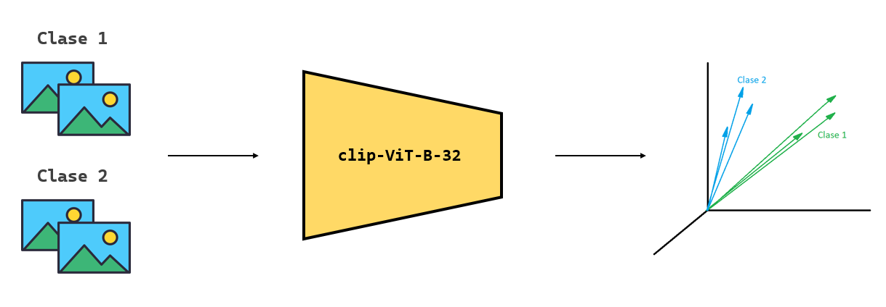
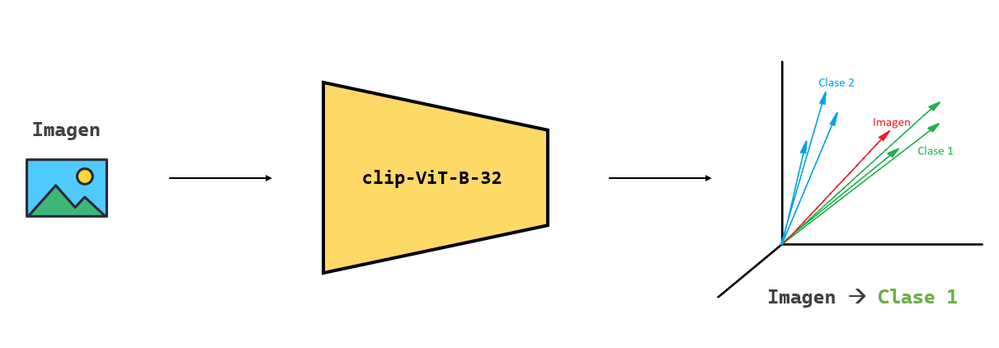
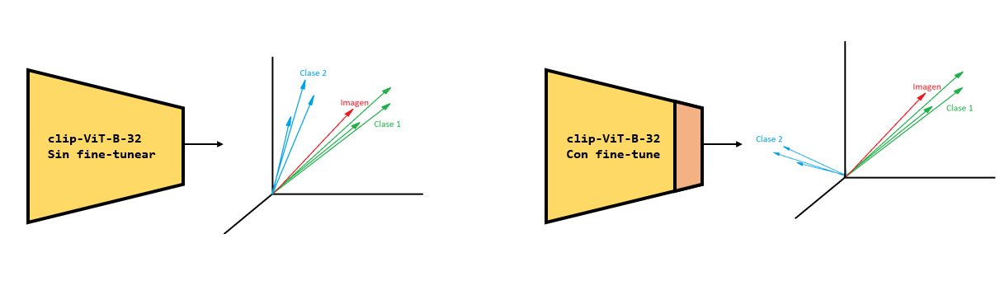

# Proyecto de Clasificación de Imágenes con Embeddings Mixtos
Este es un script de Python para clasificar imágenes utilizando el modelo CLIP.

## Descripción
El objetivo central de este proyecto es clasificar imágenes haciendo uso de embeddings mixtos, combinando tanto características visuales como semánticas. La idea detrás de los embeddings de imágenes, en particular, es convertir las imágenes en representaciones vectoriales de alta dimensión que encapsulen su contenido. Estas representaciones, conocidas como "embeddings", permiten que las imágenes se comparen y clasifiquen con facilidad.

La arquitectura CLIP (Contrastive Language–Image Pre-training) se destaca en esta tarea ya que ha sido entrenada con una amplia variedad de imágenes y textos, aprendiendo a asociar imágenes y palabras en un espacio de embeddings común. Este proyecto aprovecha este aprendizaje transferible para clasificar imágenes en diferentes categorías, basándose en la similitud semántica entre las imágenes desconocidas y un conjunto de imágenes de referencia.

El proceso de fine-tuning o afinamiento es esencial para adaptar modelos preentrenados, como el Vision Transformer (ViT), a conjuntos de datos específicos o dominios particulares. Al realizar fine-tuning, podemos beneficiarnos de la rica representación aprendida por el modelo en tareas anteriores y adaptarla para rendir al máximo en nuestro conjunto de datos objetivo.

## Estructura del Proyecto
### Scripts Principales
- FineTuningViT.py: Script para entrenar el modelo Vision Transformer (ViT) con un conjunto de datos específico.
- ClassifyImagesWithEmbeddings.py: (El script que proporcionaste) Utiliza el modelo SentenceTransformer con CLIP para clasificar imágenes en función de su similitud con imágenes de referencia.

### Carpetas de Datos
./Data/[dataset_name]/Clases: Contiene carpetas para cada clase, cada una con imágenes de referencia para esa clase.
./Data/[dataset_name]/Images: Contiene imágenes que se clasificarán y se moverán a las carpetas de clases correspondientes.
./Data/[dataset_name]/Dataset: Lugar donde se moverán las imágenes clasificadas.

## Cómo usar
Preparativos
Asegúrate de tener todas las dependencias instaladas. Este proyecto utiliza sentence_transformers, PIL, numpy, entre otros.

Configura tus carpetas de datos siguiendo la estructura mencionada anteriormente.

## Clasificación de Imágenes
Para clasificar imágenes usando el script ImageClassifier.py:

Establece el nombre del dataset que deseas clasificar al principio del script.
Elige el mode de clasificación entre 'avg' y 'max'.
Ejecuta el script. Las imágenes de ./Data/[dataset_name]/Images serán clasificadas y movidas a sus respectivas carpetas en ./Data/[dataset_name]/Dataset.
